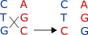
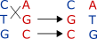

Sex sure turned out to be fun, but how did life manage to develop such a
*complicated* set of processes? Even meiosis, the process by which sex
cells are made, remains somewhat mysterious to me. In particular,
**homologous recombination** has mystified me since I learned about it
in high school.

{::nomarkdown}
<figure>

<figcaption align="center"> Chromosomal crossover (Image credit:<a href="https://commons.wikimedia.org/w/index.php?curid=8025119">Emw</a> CC BY-SA 3.0)
</figcaption>

</figure>
{:/}

**Chromosomal crossover** is the meiotic version of homologous
recombination. It’s a pretty amazing process by which, somehow, two
homologous chromosomes are aligned exactly, twisted off, and viola! Part
of mom’s side switches over to dad’s side, and vice-versa. It’s this
process that intertwines a parent’s genes, so as to make you the unique
and special flower that you are. Without recombination, you’d just be a
Mendelian flower, and Mendelian genetics is, for lack of a better word,
boring.

The crossover story I’d learned in high school biology was also boring:
that is, it’s often stated that chromosomal crossover happens *outside*
the confines of a gene. Even [Wikipedia’s entry for
DNA](https://en.wikipedia.org/wiki/DNA) currently says, “Recombination
allows chromosomes to exchange genetic information and *produces new
combinations of genes* \[emphasis added\].” That is, if grandma gave dad
genes (A1)(B1) and granddad gave dad genes (A2)(B2), recombination means
dad might give you the combination (A1)(B2) or (A2)(B1).

This is certainly one boring thing that recombination can do! But a far
more interesting form of recombination, known as **intragenic
recombination** or recombination *within* a gene, is known to occur –
and not infrequently – in humans as well as everywhere else where
chromosomes are to be found.

For now, we’ll dispense with what intragenic recombination is *for*, and
just point out what it can *do*. Under assumption of intragenic
recombination, we get a whole new set of non-Mendelian rules for
inheritance. These are far from boring. For instance, let’s say mom gave
you a codon CTG, which codes the amino acid Leucine and dad gave you the
codon AGC, which codes the amino acid Serine. When you make a sex cell
through meiosis, intragenic recombination can yield either of the
following in your child (for simplicity, I’m leaving out the
complementary strands in these images):

 , which is Leucine (CTC)
and Arginine (AGG),

or

 , which is Arginine (CGC)
and Methionine (ATG).

That is, for each codon there are two sites where recombination can
split the codon and rejoin it with its homolog, and the resulting
recombined codons may code for entirely different amino acids!

The recombination rules are analogous to “chemical reactions” of codon
pairs. The two reaction or ‘multiplication’ tables are below (the first
recombined codon is Codon 1 \* Codon 2, while the second is Codon 2 \*
Codon 1).

{::nomarkdown}
<figure>

<figcaption align="center"> Recombination with break at site 1 (click <a href src="https://nosimpler.github.io/assets/images/recombination_table2.png">here</a> to enlarge)
</figcaption>

</figure>
<figure>

<figcaption align="center"> Recombination with break at site 2 (click to enlarge)
</figcaption>

</figure>
{:/}
My absolute favorite recombination rule, though, is this one (denoting
the recombination site as \|) :

TA\|G and TG\|A -&gt; TGG and TAA

TAG, TGA, and TAA are stop codons, but TGG is tryptophan (W)!

Now, I think we might have an inkling of *why* there are three different
types of stop codon! But more than that, we have the somewhat bizarre
possibility that recombination can lead to extension of a gene, because
if a stop codon is converted to tryptophan during recombination,
transcription in the daughter cell will proceed until the next stop. And
finally, we have W as a *signature* of that extension. This of course
does not mean that all (or even most) tryptophan encoded in the genome
exists *because of* gene extension, but it would sure be a lot of fun if
we could estimate how much.

(Thanks to [Lior Pachter](https://twitter.com/lpachter) for reminding me
about the McVean paper that motivated this post!)

# References

-   McVean, Gilean A. T., Simon R. Myers, Sarah Hunt, Panos Deloukas,
    David R. Bentley, and Peter Donnelly. “The Fine-Scale Structure of
    Recombination Rate Variation in the Human Genome.” Science, April
    23, 2004. <https://doi.org/10.1126/science.1092500>.
-   Wang, Xi, Austin L. Hughes, Tatsuya Tsukamoto, Toshio Ando, and
    Teh-Hui Kao. “Evidence That Intragenic Recombination Contributes to
    Allelic Diversity of the S-RNase Gene at the Self-Incompatibility (
    S ) Locus in Petunia Inflata.” Plant Physiology 125, no. 2 (February
    1, 2001): 1012–22. <https://doi.org/10.1104/pp.125.2.1012>.
-   Watt, Ward B. “Intragenic Recombination as a Source of Population
    Genetic Variability.” The American Naturalist 106, no. 952 (1972):
    737–53.
